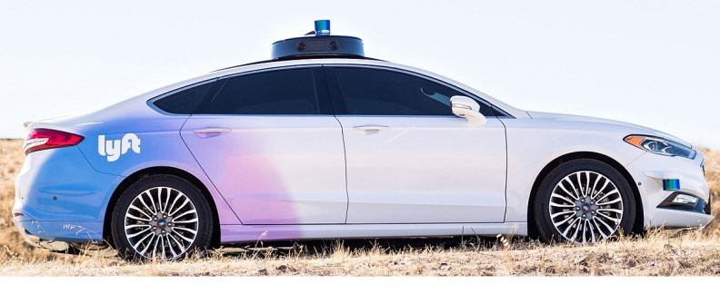

# 3D-Object Detection for Autonomous Vehicles 

With the rapid evolution in the world of technology, it becomes increasingly important for the automotive sector to keep up with the fast pace, just like any other industry. In recent times, self-driving cars have gained a lot of traction but there is a huge gap in expectation and the current state. Self Driving Vehicles are one of the most hyped technologies of the modern decade. Even though many companies may brand their driver assistance technology as “Autopilot” a truly self-driving vehicle, without a human driver on open roads, has not yet become a reality. Lyft has opensources its level5 dataset and it recently launched a kaggle competition to focus on a much harder problem - 3D object detection over semantic maps. 

## The Dataset
The Lyft dataset from the active Kaggle competition was a total of 85 GB. The data was split between testing and training sets and included a sample submission. The dataset gives a 3D point cloud and camera data from the Lyft test vehicles. The data was captured by 10 host cars on the roads of Palo Alto, California. Each of the host cars has seven cameras and one LiDAR sensor on the roof, and 2 smaller sensors underneath the headlights of the vehicle.

Source: https://www.autonews.com/mobility-report/ipo-road-show-lyft-executives-look-lower-insurance-costs

