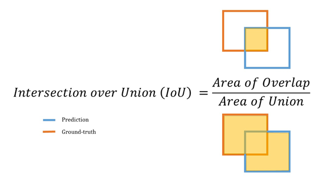
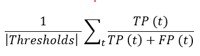

# 3D-Object Detection for Autonomous Vehicles 
## *Can you advance the state of the art in 3D object detection?*
  

*Source: https://www.autonews.com/mobility-report/ipo-road-show-lyft-executives-look-lower-insurance-costs*

## Task 
With the rapid evolution in the world of technology, it becomes increasingly important for the automotive sector to keep up with the fast pace, just like any other industry. In recent times, self-driving cars have gained a lot of traction but there is a huge gap in expectation and the current state. Self Driving Vehicles are one of the most hyped technologies of the modern decade. Even though many companies may brand their driver assistance technology as “Autopilot” a truly self-driving vehicle, without a human driver on open roads, has not yet become a reality. Lyft has opensources its level5 dataset and it recently launched a kaggle competition to focus on a much harder problem - 3D object detection over semantic maps. 

## The Dataset
The Lyft dataset from the active Kaggle competition was a total of 85 GB. The data was split between testing and training sets and included a sample submission. The dataset gives a 3D point cloud and camera data from the Lyft test vehicles. The data was captured by 10 host cars on the roads of Palo Alto, California. Each of the host cars has seven cameras and one LiDAR sensor on the roof, and 2 smaller sensors underneath the headlights of the vehicle.

## Evaluation

The average precision is calculated at different thresholds of Intersection over Union (IoU) to evaluate the object detection model. The IoU of a 2D bounding box is the area of the overlapping region divided by the total area of union. The IoU is calculated at thresholds starting from 0.55 to 0.95 with a step size of 0.05.

#### Intersection Over Union (IOU) 

  

#### Mean absolute precision (mAP) 

     

## Approach

1) Data was loaded into Google Cloud Platform instance using Kaggle API
2) Data preprocessing
   - Superimpose Lidar points from three sensors into one
   - Create Bird Eye View (BEV) using the superimposed lidar pointclouds 
   - Transform the annotated bounding boxes to BEV to create target images(shown below)
      
   - After generating the targets, transform the labels back to the real world coordinates to generate the predctions 

## Training

- Train a U-Net fully connected convolutional neural network to predict whether an object is present in the BEV 
- Threshold this probability map to fit boxes around the detections 
Modifications to the architecture and models: 
   - Reduce class weights while training using cross entropy / softmax loss
   - Height of the class was modified to be the conditional mean of individual classes
   - Changed parameters in the UNET Architecture (optimizer, sampling, batch size)
   - Added a map mask(shown below) as input with three additional channels and trained the model  
     
   - Created ensembles of models from different epochs (mean of the weights) 

## Results 

- Final model was an ensemble of models from epochs 8,9,10, 29 and 30
- Scored mAP of 0.046 on public leaderboard and 0.045 on the private leaderboard

## Future work 

- Model still fails to predict the small objects from the BEV eg. pedestrians
- The model assumes flat surface: all the objects are at the same height as that of the ego vehicle
- User only one Lidar Sweep use images and other lidar sweeps to make accurate predictions
- With better computational power, the model can be tuned efficiently
- Could try models with different architectures

## Competition result 
  
